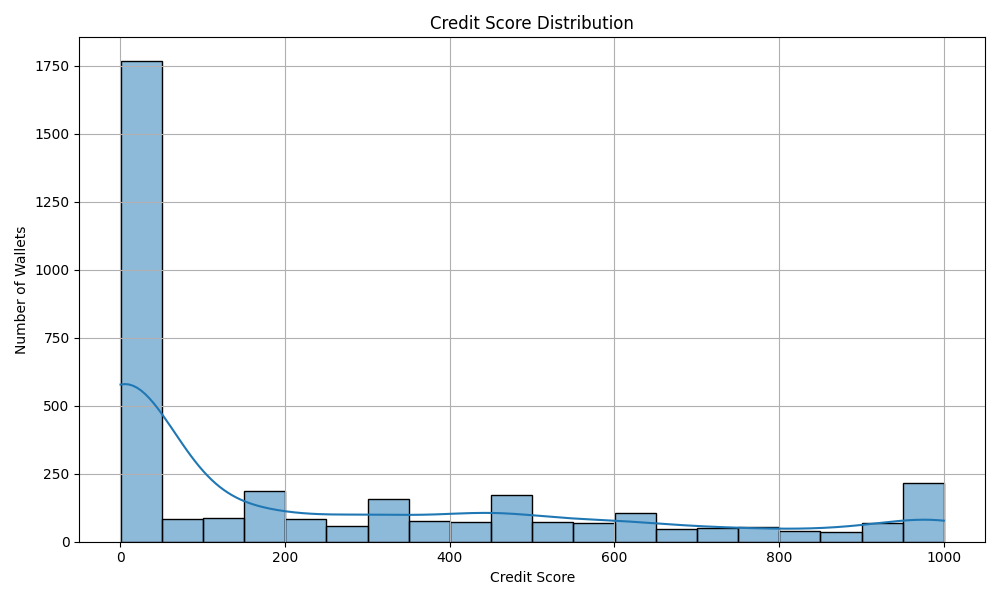

# analysis.md

# Wallet Credit Score Analysis

##  Score Distribution

The histogram above shows how wallets are distributed across credit score ranges (0–100, 100–200, ..., 500+).

##  Key Observations

###  Low Scoring Wallets (0–100)

- These wallets typically show high `liquidationcall` activity and low or no `repay` actions.
- Often lack diversity in transaction types.
- May represent abandoned, risky, or abusive accounts.

###  High Scoring Wallets (400–500+)

- Tend to have high numbers of `deposit` and `repay` transactions.
- Low or no `liquidationcall` activity.
- Healthy and active participation in the network.

##  Distribution Summary

- Most wallets fall between **100–300**, suggesting average or moderate behavior.
- Fewer wallets appear in **400+**, indicating strong financial activity and reliability.
- A small portion are in the **0–100** range, likely flagged for risky behavior.

##  Conclusion

Credit scoring helps segment wallets by reliability and usage patterns. This analysis can support DeFi platforms in offering incentives, credit limits, or flagging risky accounts.